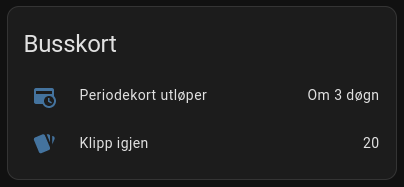

# fara-homeassistant

MQTT based integration for FARA public transit API in Home Assistant.

## Dependencies

- Rust

## Installation

```
cargo build --release
```

## Configuration

Copy `.env.example` to `.env`, and place it in the same directory as the binary. Fill in the values according to your
public transit provider, MQTT broker etc.

To find the `FARA_PTA` and `FARA_CLIENT_ID`, open the FARA webshop for your public transit provider. For example, the
AKT (Agder Kollektivtrafikk) URL is https://admin.api.fara.no/fs-webshop-client/#/login?pta=AKT Use the `pta` query
parameter as `FARA_PTA`.

Next, open developer tools in your browser, enable "persist logs", and log in. Check the "Network" tab in dev tools,
look for a call to the `token` endpoint, select the "Request" tab, and copy the `client_id` value. This is
your `FARA_CLIENT_ID`.

For Agder Kollektivtrafikk, this would result in:

```
FARA_PTA="AKT"
FARA_CLIENT_ID="webshop_akt"
```

## Running

Once it's compiled, and the `.env` file is in place, simply run the binary:

```
./fara-homeassistant
```

You should set up a cron job / scheduled task / systemd timer to run this periodically. Once a day should be enough.

## Home Assistant:

You will receive three sensors per travel card in your account:

- Period (end date of the valid period)
- Punch (number of punches left)
- Purse (amount of money left)

You can choose to present whichever of these you want / use. Here's an example:

